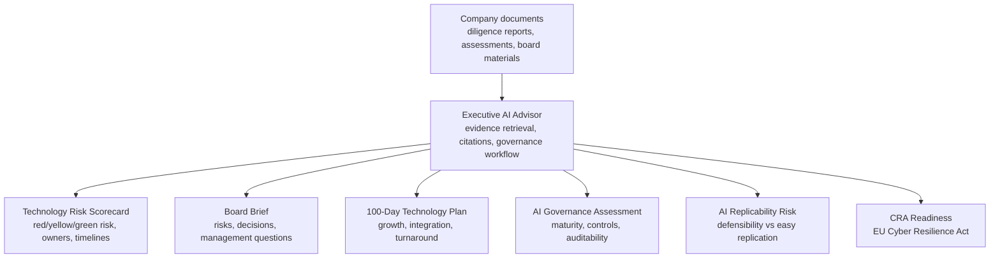

# Executive AI Advisor

Executive AI Advisor is AI-powered executive decision support for technology diligence, board briefs, risk scorecards, AI governance, and 100-day technology plans.

# Executive Deliverables

Executive AI Advisor turns uploaded company documents into board-ready outputs:



### Core deliverables

#### Technology Risk Scorecard

Executive technology risk assessment using red/yellow/green ratings, business impact, ownership, timelines, confidence levels, and success metrics.

#### Board Brief Generator

Board-ready executive summaries including key risks, business impact, recommended decisions, management questions, confidence levels, and citations.

#### 100-Day Technology Plan

Structured plans for growth, transformation, acquisition integration, and technology turnaround scenarios.

#### AI Governance Assessment

Executive assessment of AI maturity, governance, privacy, security, auditability, vendor risk, and policy readiness.

### Specialized assessments

#### AI Replicability Risk Assessment

Evaluates whether AI-enabled capabilities create durable competitive advantage or can be easily replicated by competitors. Covers proprietary data advantage, workflow and switching costs, knowledge advantage, operational maturity, and governance barriers.

Outputs include overall replicability risk (red/yellow/green), evidence and missing evidence, management questions, board discussion points, recommendations, and a 90-day improvement plan.

See [AI Replicability Risk Assessment](docs/AI-Replicability-Risk-Assessment.md).

#### Cyber Resilience Act (CRA) Readiness Assessment

EU Cyber Resilience Act-oriented readiness review for software and product companies. Produces deterministic findings, missing evidence, management questions, board discussion points, and a 90-day readiness plan.

This is diligence and governance support only — not legal advice. Legal counsel should confirm applicability and obligations.

# Example Executive Outputs

- [Technology Risk Scorecard](examples/technology-risk-scorecard.md)
- [Board Brief](examples/board-brief.md)
- [100-Day Technology Plan](examples/100-day-technology-plan.md)
- [AI Governance Assessment](examples/ai-governance-assessment.md)
- [AI Replicability Risk Assessment](docs/AI-Replicability-Risk-Assessment.md) — defensibility of AI capabilities
- Cyber Resilience Act (CRA) Readiness — generated from active investigations (see Current Capabilities and demo datasets)

## Who It Is For

- CTOs and technology executives
- PE operating partners
- Boards and investors
- Diligence teams
- AI governance leaders

## What It Demonstrates

- Executive decision support for technology diligence and value creation
- Board-level translation of technical findings into business impact
- Investigation workspaces that isolate each company, deal, or portfolio review
- Cited outputs with confidence levels, limitations, owners, timelines, and measurable actions
- AI governance, technology risk, board communication, and post-close planning workflows
- AI replicability risk and Cyber Resilience Act (CRA) readiness assessments for defensibility and regulatory diligence
- Local executive demo UI with Markdown exports and no raw JSON

## Current Capabilities

- Generate Technology Risk Scorecards with red/yellow/green ratings, confidence levels, business impact, owners, timelines, and success metrics
- Generate Board Briefs with executive summaries, top risks, management questions, recommended decisions, citations, confidence, and limitations
- Generate 100-Day Technology Plans for growth equity, acquisition integration, and turnaround scenarios
- Generate AI Governance Assessments covering AI use-case clarity, data governance, security and privacy, model/output evaluation, human oversight, cost controls, auditability, vendor risk, and policy readiness, including acceptable-use policies, knowledge governance, incident response, and board escalation
- Generate AI Knowledge Governance Assessments that evaluate whether an organization is governing enterprise knowledge appropriately across data classification, RAG readiness, enterprise search, sensitive IP protection, private model readiness, auditability, provider risk, and AI cost governance
- Upload PDFs with source type and classification metadata
- Create diligence workspaces and upload multiple PDFs per investigation
- Ask cited executive questions scoped to the active investigation by default
- Generate technology due diligence reports for active investigations
- Generate Cyber Resilience Act readiness assessments for active investigations
- Generate scenario-specific 100-day technology operating plans from diligence findings
- Review 100-day plan executive one-pagers, timeline summaries, risk heatmaps, deliverables, owners, and board checkpoints
- Generate board summaries with citations, confidence, and limitations
- Render workflows in Streamlit without raw JSON
- Export board memos, diligence reports, executive one-pagers, 100-day plans, and evaluation reports as Markdown
- Run deterministic evaluation for citation quality, groundedness, relevance, and executive usefulness

## Quick Start

Start here:

[Quick Start](docs/QuickStart.md)

For a step-by-step executive demo, use:

[Exact Demo Tutorial](docs/ExactDemoTutorial.md)

## Security Notice

Executive AI Advisor is currently safe for a local executive demo on your own machine. It is not ready to expose publicly. Before hosting it on a shared network or public URL, add authentication, lock down the database port, set `APP_DEBUG=false`, run Uvicorn without `--reload`, and protect or disable public API docs.

Mock is the default LLM provider. OpenAI, Anthropic, and Grok/xAI keys must be supplied through environment variables or the Streamlit password input for local demo sessions. Streamlit session keys are not saved by the app, and Markdown exports include provider/model metadata but never API keys. Never commit keys to the repository.

Run the lightweight tracked-file secret scan before commits:

```bash
python scripts/check_no_secrets.py
```

Short version:

```bash
cp .env.example .env
docker compose up --build
docker compose exec api alembic upgrade head
python -m pip install -r requirements.txt
streamlit run ui/streamlit_app.py
```

Open:

- Streamlit UI: `http://localhost:8501`
- FastAPI docs: `http://localhost:8000/docs`
- Health check: `http://localhost:8000/health`

## Documentation

- [Quick Start](docs/QuickStart.md)
- [Methodology](docs/Methodology.md)
- [Exact Demo Tutorial](docs/ExactDemoTutorial.md)
- [User Guide](docs/UserGuide.md)
- [Architecture](docs/Architecture.md)
- [Developer Guide](docs/DeveloperGuide.md)
- [Demo Script](docs/DemoScript.md)
- [Evaluation](docs/Evaluation.md)
- [Governance](docs/Governance.md)
- [AI Knowledge Governance Assessment](docs/AI-Knowledge-Governance-Assessment.md)
- [AI Replicability Risk Assessment](docs/AI-Replicability-Risk-Assessment.md)
- [Security](docs/Security.md)

## Development Workflow

Use feature branches and pull requests into `main`. See [Contributing](CONTRIBUTING.md), [Branch Protection](docs/BranchProtection.md), and [Release Checklist](docs/ReleaseChecklist.md) for the recommended protected-main workflow, required CI check, and release validation steps.

## Methodology

Executive AI Advisor automates portions of the CTO Operating System advisory methodology through document ingestion, retrieval, citations, diligence reports, board briefs, and 100-day technology plans. See [Methodology](docs/Methodology.md) for how this software platform relates to the CTO Operating System repository.

Executive AI Advisor is the evidence-producing assessment layer for AI Knowledge Governance. It assesses knowledge governance, IP protection, and AI readiness based on uploaded evidence.

## Technology Leadership Portfolio

This repository is part of a broader Technology Leadership Portfolio: a practical system for assessing, operating, governing, implementing, and measuring technology organizations.

| Layer | Repository | Purpose |
|---|---|---|
| Methodology | [CTO Operating System](https://github.com/serewicz/cto-operating-system) | Defines CTO, diligence, governance, board reporting, and operating partner frameworks |
| Assessment | [Executive AI Advisor](https://github.com/serewicz/Executive-AI-Advisor) | Converts company documents into diligence reports, board briefs, CRA readiness assessments, AI governance assessments, and 100-day technology plans |
| Implementation | [K8s Platform Blueprint](https://github.com/serewicz/k8s-platform-blueprint) | Provides implementation patterns for platform governance, FinOps, observability, policy controls, and compliance evidence |
| Measurement | [Engineering Operating Metrics](https://github.com/serewicz/engineering-operating-metrics) | Measures delivery flow, review quality, rework, engineering cost, AI usage cost, risk, and engineering governance |

This repository provides the assessment and planning layer. See [Technology Leadership Portfolio](docs/Technology-Leadership-Portfolio.md).

## Demo Datasets

Synthetic diligence datasets are available for local demos and testing:

- [SampleCo](data/demo/sampleco/): mid-market B2B SaaS growth equity diligence.
- [FinTechCo](data/demo/fintechco/): regulated fintech / compliance-heavy diligence.
- [AcquisitionTargetCo](data/demo/acquisition-target-co/): founder-led acquisition diligence and M&A integration readiness.

## Architecture Overview

Executive AI Advisor separates company evidence, executive outputs, and evaluation so the same source documents can support multiple board-ready workflows:

1. Create or select a diligence workspace for a company or deal.
2. Upload and classify source documents.
3. Process documents into cited evidence.
4. Generate executive-ready scorecards, briefs, plans, and AI governance assessments.
5. Export Markdown outputs for board packets, operating reviews, and diligence discussions.
6. Evaluate output quality and store evaluation runs.

See [Architecture](docs/Architecture.md) for the full system design.

## Executive Decision Modules

The Streamlit UI includes an **Executive Decision Modules** section for board, CEO, PE operating partner, and fractional CTO workflows. These outputs reuse the existing ingestion, retrieval, citation, diligence, and planning pipeline instead of duplicating RAG logic.

Available modules:

- **Technology Risk Scorecard**: red/yellow/green assessment across architecture, security, AI governance, data handling, cloud/infrastructure, delivery predictability, key-person risk, technical debt, and compliance readiness. Each row includes business impact, owner, timeline, success metric, and evidence where available.
- **Board Brief Generator**: concise board-ready summary with top technology risks, business impact, recommended board-level actions, decisions needed, management questions, confidence, limitations, and citations.
- **100-Day Technology Plan**: scenario-specific operating plan for growth equity, acquisition integration, or turnaround contexts. Outputs include owners, outcomes, success metrics, risks reduced, and board/CEO visibility points.
- **AI Governance Assessment**: executive review of use case clarity, business alignment, data governance, security/privacy, model evaluation, human review, cost management, auditability, vendor/model dependency, and policy readiness.

API endpoints:

```text
POST /executive/risk-scorecard
POST /executive/board-brief
POST /executive/100-day-plan
POST /executive/ai-governance-assessment
```

Each endpoint accepts `document_set_id`, uses the active investigation workspace as scope, and supports Markdown download from Streamlit.

## Executive Planning Outputs

100-Day Technology Plans are generated from Technology Due Diligence Report findings. The plan types are scenario-specific:

- `growth_equity`: scale readiness, governance, delivery predictability, security, AI governance, hiring coverage, and FinOps.
- `acquisition_integration`: acquirer coordination, knowledge transfer, identity mapping, data migration readiness, deployment handoff, documentation, and support transition.
- `turnaround`: urgent stabilization, spend control, backup validation, production access review, vulnerability triage, production ownership, and operating discipline.

Streamlit renders the plan in two tabs:

- Executive One-Pager: concise board-readable current state, target state, top priorities, first 30 days, board decisions, success metrics, and dependencies.
- Full 100-Day Plan: timeline summary, plan at a glance, risk heatmap, phase-based actions, deliverables, success metrics, citations, board checkpoints, dependencies, and limitations.

Risk and confidence scoring are shown in the Technology Due Diligence Report and carried into the 100-day plan risk heatmap. The heatmap includes category, risk rating, confidence, evidence count, and primary recommended action. CRA Readiness Assessment adds EU Cyber Resilience Act-oriented readiness review for software/product companies, including missing evidence, management questions, board discussion points, and a 90-day readiness plan. Markdown downloads are available for the executive one-pager, full 100-day plan, diligence report, CRA readiness assessment, board memo, and evaluation report. Export filenames include the investigation name, report type, plan type when applicable, and generation timestamp.

## Database Migrations

Alembic is the source of truth for database schema creation and schema changes. Docker runs `alembic upgrade head` before starting the API, and the command can be run explicitly after pulling schema changes:

```bash
docker compose exec api alembic upgrade head
```

If a local development volume has stale schema state, see [Quick Start](docs/QuickStart.md) or [Developer Guide](docs/DeveloperGuide.md) for the reset workflow. `docker compose down -v` deletes local database data.

## Project Status

Executive AI Advisor is an early portfolio-grade MVP. It is intended to demonstrate CTO-level architecture, AI governance thinking, secure RAG patterns, and executive decision-support workflows.

Implemented:

- FastAPI backend
- PostgreSQL with pgvector
- Docker Compose local stack
- Alembic migrations
- SQLAlchemy models
- PDF upload, parsing, chunking, embeddings, search
- cited Q&A
- board summary generation
- executive risk scorecard, board brief, 100-day plan, and AI governance modules
- technology due diligence report and 100-day plan generation
- CRA readiness assessment
- executive one-pager, timeline summary, and risk heatmap outputs for technology planning
- Streamlit UI
- deterministic evaluation framework
- SLSA provenance and security documentation

Planned:

- authentication and role-based access control
- multi-document synthesis
- background jobs
- richer export formats
- hosted deployment profiles
- RAGAS or LLM-as-judge evaluation
- audit logs and governance dashboards

## License

Apache 2.0. See [LICENSE](LICENSE).
