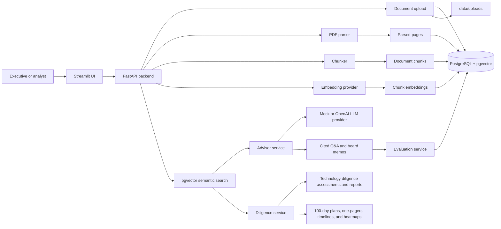

# Architecture

Executive AI Advisor is a FastAPI, PostgreSQL, pgvector, and Streamlit application for turning executive documents into cited answers, board-level summaries, technology due diligence reports, 100-day technology plans, and evaluation records.

## System Overview

The system separates ingestion, retrieval, generation, and evaluation so each layer can be tested and governed independently. Documents are uploaded through the API or Streamlit UI, parsed into page-aware text, chunked for retrieval, embedded into pgvector, searched semantically, and then used by advisor services that require citations, confidence, and limitations.

## Data Flow

1. Upload: a PDF is uploaded with `source_type` and `classification`.
2. Metadata persistence: the API creates a `Document` row with filename, file path, status, source type, classification, and metadata.
3. Parsing: the parser extracts page-aware text and stores `ParsedDocumentPage` records.
4. Page storage: each non-empty page is stored with `page_number`, text, metadata, and timestamp.
5. Chunking: parsed pages are combined into retrieval-ready chunks with page ranges and estimated token counts.
6. Embeddings: chunks are embedded using the configured provider and stored on `DocumentChunk.embedding`.
7. pgvector search: query embeddings are compared against chunk embeddings using cosine distance.
8. Cited Q&A: retrieved chunks are labeled as sources and passed to the advisor service.
9. Board memo generation: board summary prompts create structured memo sections using retrieved chunks only.
10. Technology diligence: the diligence service scores architecture, security, technical debt, key person risk, and AI readiness using retrieved evidence.
11. Technology due diligence report: targeted category retrieval across the active document set produces red/yellow/green findings, confidence levels, risk heatmap rows, management questions, board discussion points, actions, and citations.
12. 100-day planning: diligence findings are converted into scenario-specific operating plans with executive one-pagers, timeline summaries, risk heatmaps, deliverables, success metrics, board checkpoints, dependencies, and Markdown exports.
13. Evaluation: advisor answers are scored for citation quality, groundedness, relevance, and executive usefulness.

## Core Components

- FastAPI: backend API, routes, request validation, and service orchestration.
- Streamlit: board-facing demo UI that hides raw JSON.
- PostgreSQL: transactional metadata store.
- pgvector: vector storage and semantic search.
- Document parser: PDF parsing with Docling as the preferred parser and `pypdf` fallback.
- Chunker: converts page text into retrieval-ready chunks.
- Embedding providers: local embeddings by default, OpenAI embeddings optionally.
- LLM providers: mock provider by default, OpenAI chat provider optionally.
- Advisor service: cited Q&A and board memo generation.
- Diligence service: technology due diligence assessments and investigation-scoped reports with scores, risk ratings, confidence levels, risk heatmaps, recommendations, and citations.
- Planning service: 100-day technology plans generated from diligence findings, including executive one-pagers, timeline summaries, scenario-specific actions, deliverables, owners, success metrics, and board checkpoints.
- Evaluation service: deterministic scoring and persistent evaluation runs.

## Provider Strategy

Embeddings and LLM generation are abstracted behind provider interfaces.

Embedding provider defaults:

- `EMBEDDING_PROVIDER=local`
- `LOCAL_EMBEDDING_MODEL=BAAI/bge-small-en-v1.5`

Optional OpenAI embedding mode:

- `EMBEDDING_PROVIDER=openai`
- `OPENAI_API_KEY=...`
- `OPENAI_EMBEDDING_MODEL=text-embedding-3-small`

LLM provider defaults:

- `LLM_PROVIDER=mock`

Optional OpenAI chat mode:

- `LLM_PROVIDER=openai`
- `OPENAI_API_KEY=...`
- `OPENAI_CHAT_MODEL=gpt-4o-mini`

The default local/mock configuration supports demos, tests, confidentiality, cost control, and environments where external API calls are not allowed.

## Database Overview

Core tables:

- `documents`: document metadata, lifecycle status, governance classification, source type, file path, and metadata.
- `parsed_document_pages`: page-aware parsed text.
- `document_chunks`: retrieval chunks, page ranges, token counts, metadata, and embeddings.
- `document_sets` and `document_set_documents`: investigation workspaces and document associations.
- `evaluation_runs`: evaluation questions, scored results, average score, and timestamp.

Docker Compose uses `pgvector/pgvector:pg16`. The database init script enables the `vector` extension, and Alembic applies schema migrations at container startup.

## Status Lifecycle

Documents move through these statuses:

- `uploaded`
- `parsing`
- `parsed`
- `chunked`
- `embedded`
- `indexed`
- `failed`

Failed processing steps record error metadata on the document where appropriate.

## Citation Model

Retrieved chunks are assigned labels such as `[S1]`, `[S2]`, and `[S3]`. Advisor outputs are expected to cite material claims with those labels. Responses also return structured citation metadata:

- document ID
- document title
- chunk ID
- page start
- page end
- excerpt

This makes generated output inspectable without requiring a user to read raw JSON or trust an uncited answer.

## Technology Due Diligence Reports

Technology due diligence reports are generated for a selected document set, not globally. The service runs targeted retrieval queries for architecture, security, technical debt, engineering organization, key person risk, AI readiness, cloud cost, and integration readiness. Low-value chunks are filtered and citations use relevant excerpts rather than full chunks by default.

Risk ratings are deterministic directional indicators:

- `red`: material risk with stronger evidence or business impact.
- `yellow`: moderate risk requiring validation, remediation, or monitoring.
- `green`: limited evidence of concern or adequate controls based on retrieved material.

Confidence is based on the quantity and spread of retrieved evidence. Reports include limitations because retrieval may miss evidence, source documents may be incomplete, and generated outputs do not replace management interviews, technical walkthroughs, security testing, legal advice, financial advice, or investment advice.

Each report also includes an executive risk heatmap generated from the category findings. Heatmap rows include category, risk rating, confidence, evidence count, and the primary recommended action. Because reports are generated from the selected document set, the heatmap is scoped to the active investigation.

## 100-Day Technology Plans

100-day technology plans are generated from the Technology Due Diligence Report findings rather than a new global search or open-ended prompt. The planning service consumes findings, risk ratings, confidence levels, business impacts, recommended owners, citations, and the report heatmap.

Supported plan types:

- `growth_equity`: scale readiness, governance, delivery predictability, security, AI governance, and FinOps.
- `acquisition_integration`: acquirer coordination, knowledge transfer, identity mapping, data migration readiness, deployment handoff, documentation, and support transition.
- `turnaround`: urgent stabilization, spend control, backup validation, production access review, vulnerability triage, production ownership, and operating discipline.

The plan response includes:

- executive one-pager
- timeline summary with Stabilize, Govern, Modernize, and Board Readout phases
- executive risk heatmap
- plan at a glance
- phase-based actions
- concrete deliverables
- action-level success metrics
- board checkpoints
- dependencies and limitations

Streamlit renders the one-pager and full plan as separate tabs and provides Markdown downloads for both. Markdown exports preserve structured tables and do not expose raw JSON.

## Security And Governance Hooks

Implemented hooks:

- `classification` metadata: `public`, `internal`, `confidential`, `restricted`
- `source_type` metadata: `sec_filing`, `diligence_report`, `technology_assessment`, `board_material`
- local embeddings by default
- mock LLM by default
- citations, confidence, and limitations in advisor outputs
- deterministic evaluation records
- SLSA provenance and GitHub artifact attestation documentation

Planned hooks:

- multi-user authentication
- role-based access control
- audit logs
- tenant isolation
- policy checks by classification

## Future Architecture

Planned extensions:

- multi-document synthesis
- background jobs for parsing, embedding, and evaluation
- audit logs and immutable review records
- SEC API ingestion
- richer export formats such as DOCX and PDF
- hosted deployment profiles
- evaluation baselines and release gates
